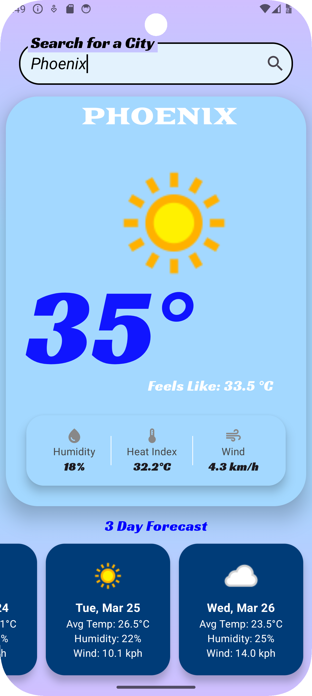
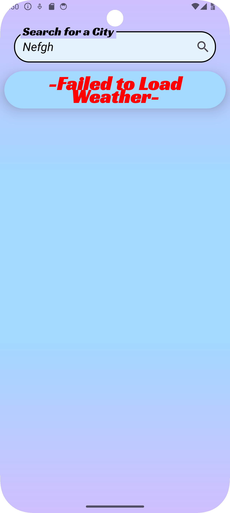
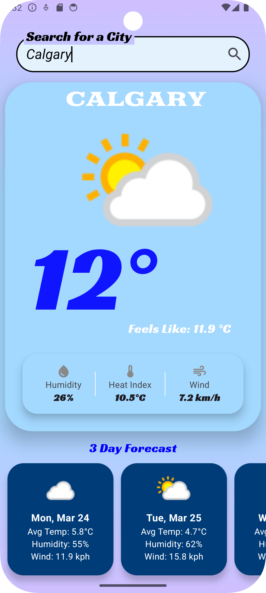
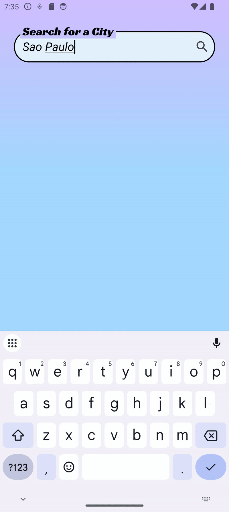

# 🌦️ WeatherApp

### WeatherApp is a modern Android application built using **Kotlin and Jetpack Compose** to fetch and display real-time weather and forecast data. 
It utilizes **Retrofit** for network calls, **Hilt for Dependency Injection**, and follows the **MVVM architecture** for a scalable and maintainable codebase. 

---

## 🚀 Key Features
- ✅ **🌍 Fetch real-time weather data by city name**
- ✅ **📅 Retrieve a 3-day weather forecast**
- ✅ **⏳ Display loading indicators while fetching data**
- ✅ **⚡ Error handling for network failures**
- ✅ **🎨 Modern UI with Jetpack Compose** 

---

## 🛠️ Technologies & Tools Used

### 📌 **Languages & Frameworks**
- **Kotlin** – Primary programming language
- **Jetpack Compose** – Modern UI toolkit for declarative UI

### 📌 **Architecture**
- **MVVM (Model-View-ViewModel)** – Ensures separation of concerns

### 📌 **Networking & API Integration**
- **Retrofit** – HTTP client for API calls
- **Gson** – For JSON parsing
- **Weather API** – Fetches real-time weather data

### 📌 **Dependency Injection**
- **Hilt (Dagger Hilt)** – Manages dependencies efficiently

### 📌 **Asynchronous Programming**
- **Coroutines & ViewModelScope** – Handles API requests efficiently
- **LiveData** – Observes and updates UI reactively


### 📌 Error Handling & State Management:
- **Sealed Classes** – For handling API responses (Success, Error, Loading)
- **Try-Catch Blocks** – Ensures graceful error handling

---

## 📸 Screenshots






---

## 🎥 Demo


---

## 💡 Why This Project?
I built **WeatherApp** to:
- Gain hands-on experience with **API integration using Retrofit**.
- Implement **Jetpack Compose UI** for a modern and responsive design.
- Learn **MVVM architecture** for better state management.
- Improve my skills in **handling network errors and data fetching**.

---

## 📌 Lessons Learned
- How to set up and use **Retrofit API calls**.
- How to manage **state and UI updates with ViewModel & LiveData**.
- How to implement **Coil library** for loading images.
- How to use **Jetpack Navigation (NavHost, NavController, NavGraph)**.
- The **challenges of designing an intuitive and visually appealing UI**.

---

## 🔥 Future Improvements (Planned)
- **📍 Location-based weather using GPS** 
- **💬 Multi-language support** 
- **📊 Interactive weather charts** 
- **🌙 Dark Mode Support** 

---

## 🔧 Installation
Clone the repository:
```bash
git clone https://github.com/TravisKula/WeatherApp.git
```
- 1️⃣ **Open in Android Studio.**
- 2️⃣ **Connect an emulator or physical device.**
- 3️⃣ **Click Run ▶️ to start the app.**
- 4️⃣ **Enter a city to check the weather!**

**Note: You will need to obtain your own API key from the Weather API provider and configure it in the app.** 
   
---

## 📌 Want to See More?
🚀 Check out my other projects on **[GitHub](https://github.com/TravisKula)**!

